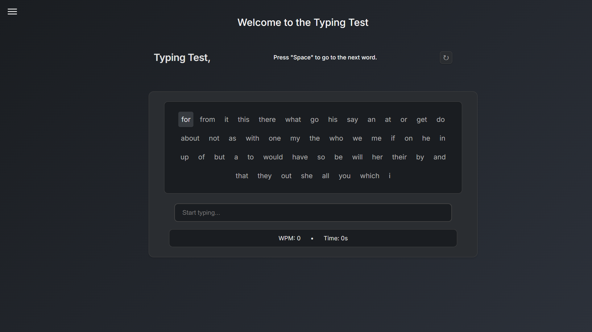
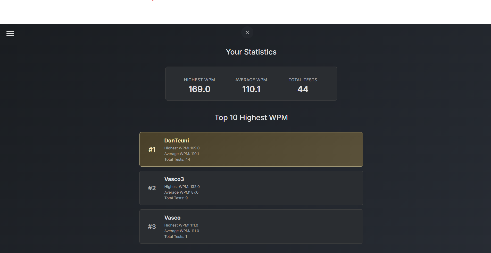
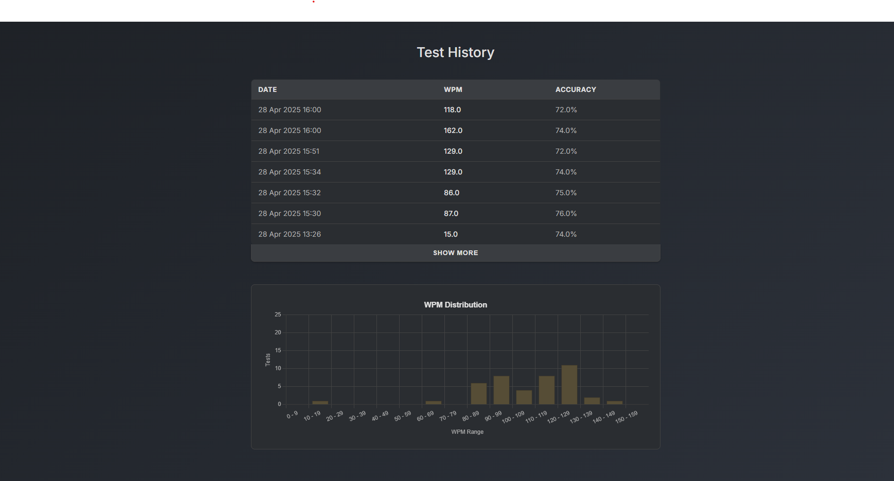

# Final exam 
# Vasco van Gils
# 9018921@student.zadkine.nl

**This is a TypeTest, using an custom made API to generate random words. This "Test" will show you how fast you can type a minute (WPM = Words Per Minute).**

## How it's made:
**Tech used:**

Express.js for the backend, React.js for the frontend, it's written in Typescript. As database XAMPP with MySQL is used. For the API, Postman API is used.

## Optimizations:

Implemented debouncing for API calls to prevent excessive requests

Added caching for frequently used words to improve performance


## Lessons learned:

I learned how to create a custom API (Github link: https://github.com/vmvangils/Random_Word_Generator). I also learned how to create a Docker Container, which makes it so that I can press "start" and start the API. I also learned a bit more about Postman, mostly how to create a variable to add more security for a API key.

## Features:

- Real-time WPM (Words Per Minute) calculation with live counter
- Custom API integration for random word generation
- History tracking of typing sessions
- User-friendly interface with visual feedback

## Photo's of the project.

<details>
<summary>Click to view project images</summary>

### Main TypeTest Interface


### History View #1


### History View #2

</details>

## Prerequisites:

Before running the project, make sure you have the following installed:
- Node.js (v14 or higher)
- npm (Node Package Manager)
- XAMPP with MySQL
- Docker (For the API container)
- Postman (for running the API)

## Installation Steps:

**Database Setup:**
  - Start XAMPP and ensure MySQL is running
  - Import the database schema from the `backend/database` folder

**API Setup:**
  - Open Postman and import the API collection
  - Download the code from https://github.com/vmvangils/Random_Word_Generator
  - Set up your API key as an environment variable in Postman
  - Start the API container using Docker

**Project Setup:**
  - Clone the repository
  - Navigate to the project directory
  - Run the installation commands for both backend and frontend

## How to run the project?

**To run the backend:**
```bash
cd backend
npm install
npm run dev
```

**To run the frontend:**
```bash
cd frontend
npm install
npm start
```

